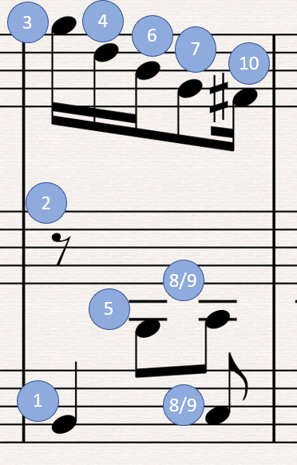

*************************
C128 BASIC music programs
*************************

.. contents::

Introduction
############

The Commodore 128's BASIC 7.0 has commands for playing music.

TODO: Write quick overview

chiptuneSAK handles the tedium for you
#######################################

What makes using the PLAY command so crazy difficult to program is that you have to order the voices' notes and rests in a particular way to get the expected rhythmic playback.  When note durations overlap between voices, the shorter duration notes must be declared after the longer notes in which they "nest".  This become difficult to do manually for 3-part music.

Here's an example from a measure from test/data/BWV_799.mid (a Bach 3-part invention):

In a PLAY command, the notes and rests must be ordered as shown, or else the rhythm will playback incorrectly (however, 8 and 9 can be swapped without consequence).  Fortunately, chiptuneSAK does this for you.

How tempo is calculated
#######################

Tempo is 1 to 255, where 1 is the slowest, and 255 is the fastest speed

Internally, the C128 assigns the following starting duration values to the following note types (see BASIC ROM disassembly starting at $6F07):
* Whole/Semibreve = 1152 (note: 1152 is 2^7 * 3^2)
* Half/Minim = 576
* Quarter/Crotchet = 288
* Eighth/Quaver = 144
* Sixteenth/Semiquaver = 72

Each voice that is playing a note has a certain amount of duration left.  Once per screen refresh, the C128 BASIC IRQ routine is called, which updates sprites, music, etc.  On each update, each voice's remaining note duration has the tempo value subtracted from it.  When the subtraction results in a value < 0, the note is done.  This implies the following:
1. Otherwise simultaneous notes will sometimes playback in a staggered way at certain tempos, due to "roundoff" error caused by subtracting a tempo that does not evenly divide the remaining duration values 
2. NTSC has faster playback than PAL

BPM (beats per minute) can be be thought of as time-signature denominators per minute.  However, in this library the MIDI standard of QPM (quarter notes per minute) is used.  So given a QPM, the C128 PLAY TEMPO can be computed as follows:
::
    tempo = qpm / 60 sec per min / 4 * 1152 / frameRateHz
