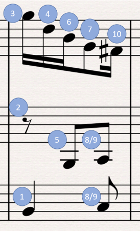

*************************
C128 BASIC music programs
*************************

.. contents::

ChiptuneSAK has an engine that creates BASIC programs to play music on the Commodore 128.  These generated programs make use of C128's BASIC 7.0 music commands:

* PLAY - specify notes to be played by one or more voices
* TEMPO - determines the playback speed for the PLAY commands
* VOL - allows control of volume
* ENVELOPE - sets a voice's Attack, Decay, Sustain, Release (ADSR), waveform, and pulse
* FILTER - controls the filters on the SID chip
* SOUND - for sound effects

Using the PLAY command
######################

Very little music is available in C128 BASIC because it is challenging to write by hand.

What makes using the PLAY command so crazy difficult to program is that you have to order the voices' notes and rests in a particular way to get the expected rhythmic playback.  When note durations overlap between voices, the shorter duration notes must be declared *after* the longer notes into which they "nest".  This can become complex and difficult to do manually for 3-part music.

Here's an example from a measure from tests/data/BWV_799.mid (a Bach 3-part invention):

Using the PLAY command, the notes and rests must be ordered as shown, or else the rhythm will play incorrectly (although 8 and 9 can be swapped without consequence).

TEMPO calculation
#################

The TEMPO command sets tempo to a value between 1 and 255, where 1 is the slowest and 255 is the fastest speed.

Internally, the C128 assigns the following starting duration values to the following note types (refer to a BASIC ROM disassembly starting at $6F07):

* Whole/Semibreve = 1152 (note: 1152 is 2^7 * 3^2)
* Half/Minim = 576
* Quarter/Crotchet = 288
* Eighth/Quaver = 144
* Sixteenth/Semiquaver = 72

During playback, BASIC maintains a "duration left" value for each voice that is playing.  Once per screen refresh, the C128 BASIC IRQ routine is called, which updates sprites, music, etc.  On each update, each voice's remaining note duration has the TEMPO value subtracted from it.  When the subtraction results in a value < 0, the note is finished.  This implies the following:

1. Otherwise simultaneous notes will sometimes play in a staggered way at certain tempos, due to "roundoff" error caused by subtracting a tempo that does not evenly divide the remaining duration values. To remedy this situation, the PLAY command has an option for a synchronization marker that allows all the voices to "catch up."  However, this synchronization cannot be used while a note is playing in any of the voices. The programmer must find a point in the music at which every voice has finished its note to insert it.

2. NTSC has faster playback than PAL

BPM (beats per minute) can be be thought of as time-signature denominators per minute.  However, in this library the MIDI standard of QPM (quarter notes per minute) is used.  So given a QPM, the C128 PLAY TEMPO can be computed as follows:

::

    tempo = qpm / 60 sec per min / 4 * 1152 / frameRateHz

ChiptuneSAK handles all the details
###################################

The ChiptuneSAK  :ref:`C128 Basic` class handles all the details that make programming music in BASIC 7.0 tedious. It calculates the proper TEMPO for the song, and has an algorithm that generates the PLAY commands with the notes in the correct order. These commands synchronize all the voices at the end of each measure so that round-off errors do not accumulate.

Because of the synchronization and the limited number of note durations that BASIC allows, the C128Basic class requires MChirp, or music that has already been converted to measures.
