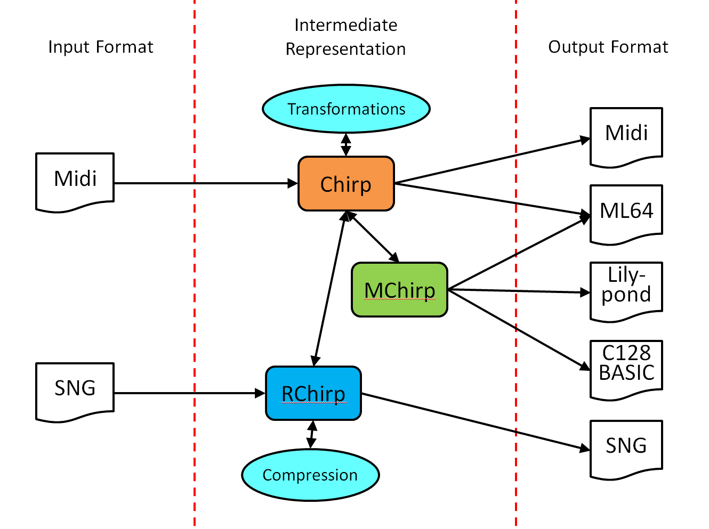

*****
Chirp
*****

.. contents::

*************
Chirp Formats
*************

Chirp (**Ch**\ iptuneSAK **I**\ ntermediate **R**\ e\ **P**\ resentation) is ChiptuneSAK's framework-independent music representation.  Different music formats can be converted to and from chirp.  To make it easier for developers to target different imput/output formats, chirp comes in three forms:  chirp (general), mchrip (sheetmusic aware), and rchirp (tracker aware).

Chirp
#####

Chirp maps note events to a tick timeline.  This is different than midi, which records the ticks between events.  Ticks are temporally unitless, and can be mapped to time by applying a BPM.  This has parallels to other music formats such as GoatTracker sng files, in which rows show order and proportion, but are not tied to time until a tempo is applied (number of jiffies per row).

MChirp
######
MChirp is Measure-Based Chirp.  It is closely related to chirp, but is measure aware, and is designed to aid reasoning about measures and bars, as is often the case when dealing with sheet music.  MChirp is quantized, and has no single-channel polyphony (polyphony across channels is expected).

Chirp can be converted to MChirp and vise versa.  Because each format retains different details, the conversion is necessarily lossy.

RChirp
######
RChirp is Row-Based Chirp.  It is meant to represent row-based sequences, as would be created by a tracker. RChirp is designed to enable operations that are naturally tied to row-based music players, including pattern matching and compression, creation of effects, and conversion between PAL and NTSC.

RChirp is quantized, and has no single-channel polyphony.

Chirp Workflows
###############

**************************************
Concepts in chirp music representation
**************************************

Tempo (BPM and QPM)
###################
Music rhythm is periodic, and consists of patterns of stressed and unstressed pulses.  The stressed pulses are called beats.  Tempo is commonly expressed in terms of Beats Per Minute (BPM).

Sheet music will usually indicate the song's initial tempo above the first measure using either Italian descriptors (e.g., "Largo", "Moderato", "Allegro", etc.) or metronome markings (e.g., "quarter note = 120").  Metronome markings tell you the Beats Per Minute (BPM) in terms of a specific note type.  By itself, the BPM can't tell you how fast a piece will play -- to do this, it must be combined with the piece's initial time signature (aka meter).  Together, the temporally-unitless proportions found in the music become tied to an absolute time frame.

The initial time signature appears before the first measure, and usually looks like one number above another, like a fraction.  For "simple" time signatures (e.g., 2/4, 3/4, 3/8, 4/4, etc.) the upper number shows how many beats are in a measure (aka bar), and the lower number shows the note type that represents a beat (4 = quarter, 8 = eighth, etc.).  Example: 3/2 has 3 half notes per measure.  This also holds true for "complex" time signatures (e.g., 5/8, 7/4, 11/8, etc.).  In general, time signatures indicate the periodicity of accents in the music's rhythm.

When composers divide beats by powers of two (whole note into halves, quarters, 8ths, etc.), there are note types to express these subdivisions.  When a beat is divided into three equals parts, there is no note type to express a 0.33333333 subdivision.  In music notation, triplets often come to the rescue, which map three equal durations to the duration of either one or two notes.  In the 8-bit tracker world, composers simply choose a number of duration rows that when divided by 3 yield integer solutions (e.g., a fast tempo using 24 rows for a quarter note can turn into three groups of 8 rows).  There are sheet music analogs to this practice which can use standard note durations to express divisions of three.  The simplest is to use a 3/4 (or 3/8) time signature.  But when unwanted triplets still occur, a "compound" meter (e.g. 6/8, 9/8, 12/8) can be used.  The fundamental beat in compound meters is dotted (note value + a half of the note's value), allowing clean divisions by three.  In compound meters, the metronome markings will usually show a dotted note = to a beat count per minute.  

ChiptuneSAK preserves tempo across various transformations and music formats.  Like MIDI, chirp understands tempos in terms of quarter notes per minute (QPM).  Many music input formats explicitly represent tempos and time signatures (i.e., midi and MusicXML), and ChiptuneSAK will internally convert and store this information as QPM.  This simplifies the concept of tempo by expressing it in terms of a consistent note type.  Examples:

* a 3/8 meter with metronome mark "eighth note = 120" becomes QPM = 60
* a 6/8 meter with metronome mark "dotted quarter = 40" becomes QPM = 60

Tempo in Trackers
#################

BPM and rows
************

In reasoning about tracker tempos, a common mental anchor point between rows and BPM is that 6 frames per row is around 125BPM on a PAL machine.  This forms the basis of many trackers' default tempo choice of 6 frames per row.

In this case, 6 frames per row * a PAL C64's 20ms per frame = 0.12 seconds per row.  That's 1/0.12 or 8.333333 rows per sec, so 60 seconds / 0.12 sec per row = 500 rows per minute.  500 rows per min / 125 BPM = 4 rows per quarter note in 4/4, which means a single row becomes a 16th note.

Multispeed
**********

Instead of a single music player update per frame, "multispeed" allows multiple player updates per frame.  This means different things in different trackers.  In SID-Wizard, only the tables (waveform, pulse, and filter) are affected, but the onset of new notes only happens on frame boundaries.  In GoatTracker, the entire engine is driven faster, requiring speedtable values (e.g. tempos) and gateoff timers to be multiplied by the multispeed factor.
Currently, ctsGoatTracker.py does not implement multispeed handling.

Octave and Frequency designations
#################################
Chirp frequency reasoning will default to a twelve-tone equal temperament system.
Middle C is 261.63Hz, and following Scientific Pitch Notation (SPN), Chirp assigns middle C to be C4 with midi note number 60.  The relationship between the chirp note number and its frequency is 440*2^((m-69)/12), where 69 is the midi number for A4, which is defined as exactly 440Hz ("concert A").

Some midi octave conventions differ, e.g., assigning middle C (261.63Hz) to C3 with midi note number 60.  However, since midi really does not have a note-octave representation, this difference is only one of convention. With respect to chirp, such a system has an octave offset of -1.

Historically, 432 Hz (France) and 435 Hz (Italy) were competing tuning standards.  By 1953, nearly everyone had agreed on 440 Hz, which is an `ISO standard <https://www.iso.org/standard/3601.html>`_ for all instruments based on chromatic scale.  The SID chip covers 8 octaves, from C0 to B11.  However, with 440 tuning, the PAL can't reach note B11 (SID freq 67280, > 16bit), so some in the scene use frequency tables tuned to 435 Hz (where B11 in PAL is 66516)
