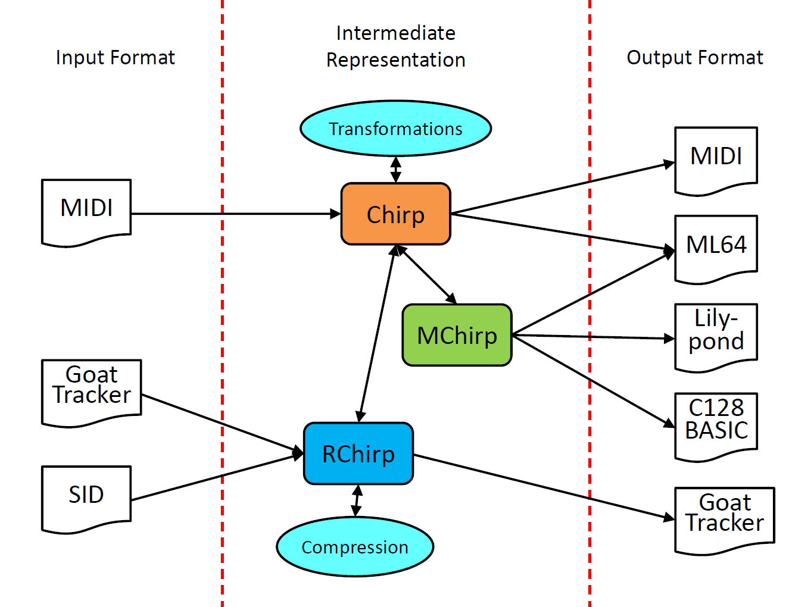
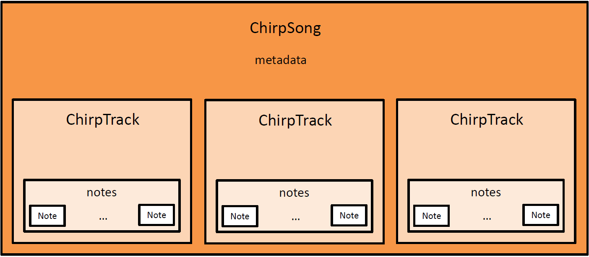
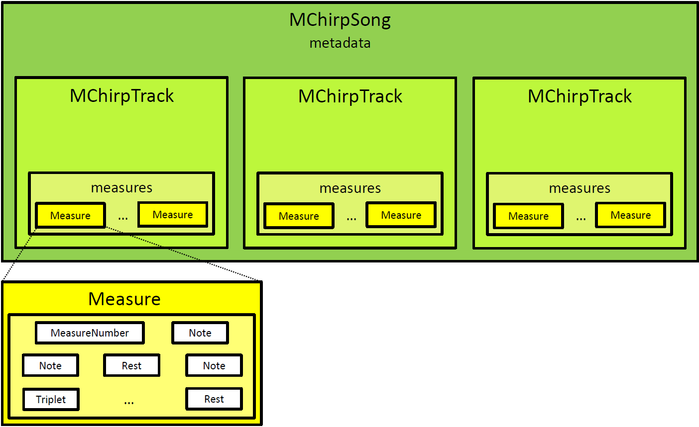
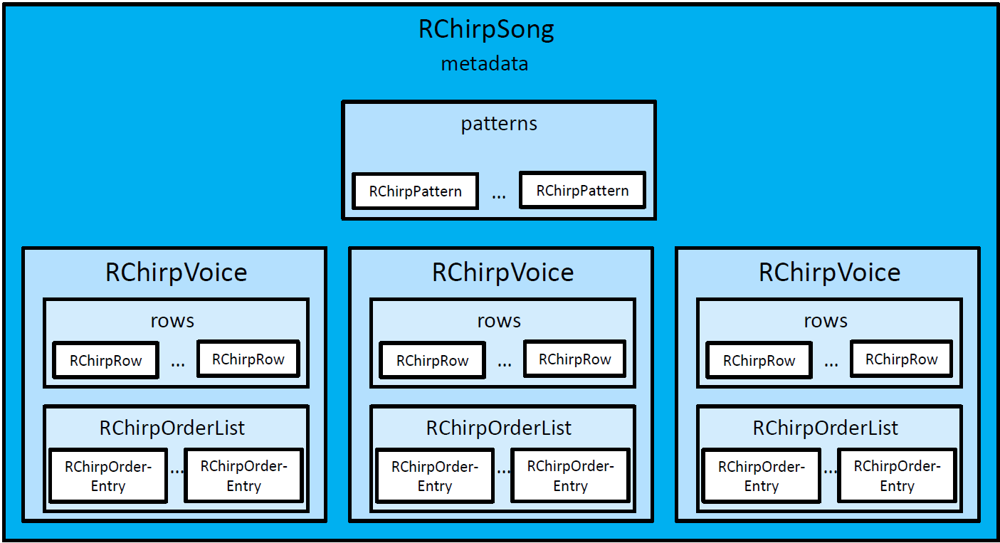

========================================
ChiptuneSAK Intermediate Representations
========================================

.. contents::

Intermediate Representations
----------------------------

Chirp (**Ch**\ iptuneSAK **I**\ ntermediate **R**\ e\ **P**\ resentation) is ChiptuneSAK's framework-independent music representation.  Different music formats can be converted to and from chirp.  To make it easier for developers to target different input/output formats, chirp comes in three forms:  **Chirp** (abstraction is notes and durations), **MChirp** (abstraction is measures) and **RChirp** (abstraction is tracker rows).

Chirp Representation
####################

Chirp maps note events to a tick timeline.  This mapping is different than midi, which records events only and the ticks between events. Ticks are temporally unitless, and can be mapped to time by applying a tempo in BPM.  In MIDI, note_on and note_off events come with no particular identification of the note they are starting or ending. Chirp reinterprets these events to provide note starts and lengths, which is closer to the way that humans think about music content.

Chirp notes are not necessarily quantized and polyphony is allowed.

MChirp Representation
#####################

MChirp is Measure-Based Chirp.  It has many features in common with Chirp: the content consists of notes in a tick-based time framework.  However, MChirp requires that all notes must fall into measures with well-defined boundaries and time signatures.

Note start times and durations in MChirp are quantized, and channels have no polyphony. All notes within a measure are contained within an MChirp Measure object.

Chirp can be converted to MChirp and vice-versa.  Because each format retains different details, the conversion may be lossy.

RChirp Representation
#####################

RChirp is Row-Based Chirp.  It represents the patterns (sequences) of notes around which 8-bit music play routines and trackers are built. RChirp is designed to enable operations that are naturally tied to row-based players, including pattern matching and compression.  A row often holds the sound chip's state after a play routine update.  RChirp is quantized, and has no single-channel polyphony.

In RChirp, the row is the primary abstraction.  RChirp also directly represents patterns and orderlists of patterns.

Chirp Workflows
---------------

This diagram illustrates the relationships between the various intermediate representations and external music formats.

For example, a Goattracker.sng file can be imported to RChirp, which may then be converted to Chirp and finally to MChirp, from which sheet music can be generated using Lilypond.

Most basic transformations of music (such as transposition, quantization, etc) are implemented for the Chirp representation.

Details of Intermediate Representations
---------------------------------------

Chirp details
#############

The Chirp representation is primarily dependent on three basic concepts, each implemented as a class. These classes are the :ref:`ChirpSong`, the :ref:`ChirpTrack`, and the :ref:`Note`.

A :ref:`ChirpSong` contains information about a song.  It contains a variety of information, but the most important data member of the :ref:`ChirpSong` class is ``ChirpSong.Tracks``, which is a list of :ref:`ChirpTrack` objects.

Each :ref:`ChirpTrack` represents one voice; while the instrument for a :ref:`ChirpTrack` can change, it can only be one instrument at a time.  The primary data member of the :ref:`ChirpTrack` class is ``ChirpTrack.Notes``, a list of :ref:`Note` objects.

Each :ref:`Note` object represents a single note. The ref:`Note` has a pitch (specified using MIDI note numbers), a start time (measured in MIDI ticks), a duration, and a velocity (which is mostly used for volume). These properties are all that is required for the Chirp representation of a note.

MChirp details
##############

The MChirp representation, like the Chirp representation, has song (:ref:`MChirpSong`) and track (:ref:`MChirpTrack`) objects, which, at a high level, behave much like their Chirp counterparts.

However, :ref:`MChirpTrack` objects have a list of :ref:`Measure` objects instead of a list of notes.  Each :ref:`Measure` object contains a list of events that occur in the measure, including :ref:`Note` and :ref:`Rest` objects.  Measures also contain events for the measure number, program changes, tempo changes, etc.

Each :ref:`Measure` is guaranteed to contain exactly the content of a single measure.  All space is used; space between notes is filled with rests.

In a :ref:`Measure`, notes that form triplets are contained within :ref:`Triplet` objects.

To support measure-based representation of notes, two members that refer to ties between notes have been added to the ref:`Note` class:  ``Note.tied_from`` and ``Note.tied_to``.  These members are only used in the MChirp representation.

RChirp details
##############

The RChirp representation is quite different from the other intermediate representations in ChiptuneSAK.  While the song is represented by the :ref:`RChirpSong` class, it contains no tracks.  Instead, :ref:`RChirpSong` contains a list of :ref:`RChirpVoice` classes, each representing a single voice.  The distinction is made because voices, unlike tracks, reflect the underlying hardware.

The musical content of each :ref:`RChirpVoice` is contained in its ``RChirpVoice.rows`` member, which is a list of :ref:`RChirpRow` objects, each representing a tracker row or the sound chip state after a play call update.

However, the :ref:`RChirpVoice` can optionally contain the content in a separate format as well: as an :ref:`RChirpOrderList` that specifies patterns and repeats. The :ref:`RChirpOrderList` is a list of :ref:`RChirpOrderEntry` objects, which in turn point to :ref:`RChirpPattern` entries in the ``RChirpSong.patterns`` list for the song as a whole.

The :ref:`RChirpPattern` and :ref:`RChirpOrderList` objects are created by compression algorithms that discover and exploit repetitions in the musical content to make the song smaller.  For the most part, they are not meant to be manipulated directly.

Notes on Chirp Music Representation
-----------------------------------

Tempo (BPM and QPM)
###################
Music rhythm is periodic, and consists of patterns of stressed and unstressed pulses.  The stressed pulses are called beats.  Tempo is commonly expressed in terms of Beats Per Minute (BPM).

Sheet music will usually indicate the song's initial tempo above the first measure using either Italian descriptors (e.g., "Largo", "Moderato", "Allegro", etc.) or metronome markings (e.g., "quarter note = 120").  Metronome markings tell you the Beats Per Minute (BPM) in terms of a specific note type.  By itself, the BPM can't tell you how fast a piece will play -- to do this, it must be combined with the piece's initial time signature (aka meter).  Together, the temporally-unitless proportions found in the music become tied to an absolute time frame.

The initial time signature appears before the first measure, and usually looks like one number above another, like a fraction.  For "simple" time signatures (e.g., 2/4, 3/4, 3/8, 4/4, etc.) the upper number shows how many beats are in a measure (aka bar), and the lower number shows the note type that represents a beat (4 = quarter, 8 = eighth, etc.).  Example: 3/2 has 3 half notes per measure.  This also holds true for "complex" time signatures (e.g., 5/8, 7/4, 11/8, etc.).  In general, time signatures indicate the periodicity of accents in the music's rhythm.

When composers divide beats by powers of two (whole note into halves, quarters, 8ths, etc.), there are note types to express these subdivisions.  When a beat is divided into three equals parts, there is no note type to express a 0.33333333 subdivision.  In music notation, triplets often come to the rescue, which map three equal durations to the duration of either one or two notes.  In the 8-bit tracker world, composers simply choose a number of duration rows that when divided by 3 yield integer solutions (e.g., a fast tempo using 24 rows for a quarter note can turn into three groups of 8 rows).  There are sheet music analogs to this practice which can use standard note durations to express divisions of three.  The simplest is to use a 3/4 (or 3/8) time signature.  But when unwanted triplets still occur, a "compound" meter (e.g. 6/8, 9/8, 12/8) can be used.  The fundamental beat in compound meters is dotted (note value + a half of the note's value), allowing clean divisions by three.  In compound meters, the metronome markings will usually show a dotted note = to a beat count per minute.

ChiptuneSAK preserves tempo across various transformations and music formats.  Like MIDI, chirp understands tempos in terms of quarter notes per minute (QPM).  Many music input formats explicitly represent tempos and time signatures (i.e., midi and MusicXML), and ChiptuneSAK will internally convert and store this information as QPM.  This simplifies the concept of tempo by expressing it in terms of a consistent note type.  Examples:

* a 3/8 meter with metronome mark "eighth note = 120" becomes QPM = 60
* a 6/8 meter with metronome mark "dotted quarter = 40" becomes QPM = 60

Tempo in Trackers
#################

BPM and rows
************

In reasoning about tracker tempos, a common mental anchor point between rows and BPM is that 6 frames per row is around 125BPM on a PAL machine, when a row has a frame duration.  This forms the basis of many trackers' default tempo choice of 6 frames per row.

In this case, 6 frames per row * a PAL C64's 20ms per frame = 0.12 seconds per row.  That's 1/0.12 or 8.333333 rows per sec, so 60 seconds / 0.12 sec per row = 500 rows per minute.  500 rows per min / 125 BPM = 4 rows per quarter note in 4/4, which means a single row becomes a 16th note.

Multispeed
**********

Instead of a single music player update per frame, "multispeed" allows multiple player updates per frame.  This means different things in different trackers.  In SID-Wizard, only the tables (waveform, pulse, and filter) are affected, but the onset of new notes only happens on frame boundaries.  In GoatTracker, the entire engine is driven faster, requiring speedtable values (e.g. tempos) and gateoff timers to be multiplied by the multispeed factor.  Currently, goat_tracker.py does not implement multispeed handling.  To accommodate multispeed, sid.py uses milliframe units.

Octave and Frequency designations
#################################
Chirp frequency reasoning defaults to the most common MIDI convention, a twelve-tone equal-tempered system with MIDI note 69 = A4 = 440 Hz as described in the :ref:`Tuning` section.

