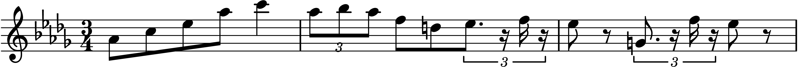
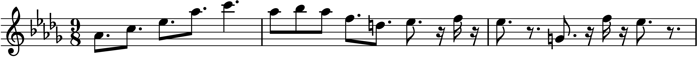

====================
ChiptuneSAK Examples
====================

.. toctree::
   :caption: Table of Contents
   :maxdepth: 2

Chirp Examples
--------------

Lilypond Sheet Music Examples
-----------------------------

Lilypond Song to PDF
++++++++++++++++++++

In this example a MIDI song is read in and output to a multi-page PDF document:

.. literalinclude:: ../examples/lilypondExample.py
    :language: python

Lilypond Measures to PNG
++++++++++++++++++++++++

In this example a MIDI song is read, and a snippet of measures is converted to a PNG image;

.. literalinclude:: ../examples/lilypondClipExample.py
    :language: python

C128 Basic Example
------------------

In this example a MIDI song is read and converted to C128 BASIC:

.. literalinclude:: ../examples/c128BasicExample.py
    :language: python

Metric Modulation Examples
--------------------------

Fix too-short note durations
++++++++++++++++++++++++++++

examples/data/C128/BWV_799.mid is a three-part Bach invention. It contains a few 32nd notes near the end.

Unfortuately, C128 BASIC only supports notes down to 16th notes, so exporting this piece to C128 BASIC without loss of those notes is not possible without metric modulation.

In the :ref:`C128 Basic Example`, the line

::

    chirp_song.modulate(2, 1)

Makes all the notes 2/1 = 2X as long, so the 32nd notes turn into 16th notes.  The tempo is changed to compensate so the song sounds correct.  Exporting the song to C128 BASIC now works correctly.

Eliminate triplets
++++++++++++++++++

Many chiptunes music players do not support triplets.  Here we show you how to use metric modulation to eliminate triplets.

It may seem a little surprising, but *modulation by a factor of 3/2 eliminates all triplets.*

As an example, consider the following excerpt from a Chopin waltz:

This except could not be rendered using many chiptunes tools that cannot do triplets.   But if we modulate by a factor of 3/2, the excerpt becomes:

The shortest note is now a sixteenth note, which means this music can now be rendered by a system that only accepts factor-of-two note values!

