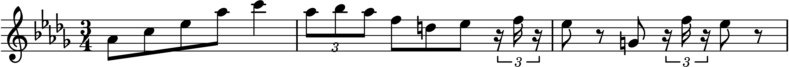

====================
ChiptuneSAK Examples
====================

.. contents::

Chirp Examples
--------------

MS-DOS Game MIDI Example
++++++++++++++++++++++++

In this example a midi file captured from an MS-DOS game is processed and turned into sheet music as well as exported to GoatTracker.

Usually, `midi captured from DOS games <http://www.mirsoft.info/gamemids-ripping-guide.php/>`_ results in messy midi files that don't include keys, time signatures, or even reliable ticks per quarter notes.

So first use the FitPPQ.py script to estimate the true note lengths and adjust them to a ppq of 960.  From the tools directory, run:

::

    FitPPQ.py -s 4.0 ../examples/data/mercantile/betrayalKrondorMercantile.mid ../examples/data/mercantile/tmp.mid

This should generate the following output:

::

        Reading file ../examples/data/mercantile/betrayalKrondorMercantile.mid
        Finding initial parameters...
        Refining...
        scale_factor = 5.8900000, offset = 2398, total error = 4082.2 ticks (22.51 ticks/note for ppq = 960)
        Writing file ../examples/data/mercantile/tmp.mid

It is a good idea to do a sanity check on the output file, as the algorithm in FitPPQ often fails to give the best solution.  A general algorithm to find the beats in a midi file is a daunting task!

In fact, an ideal method now is to use the output obtained from FitPPQ, open the resulting file and adjust the first beat of the final measure to lie *exactly* at the start of the final measure.  If we do this with tmp.mid, we find that the first note of the final measure is at MIDI tick 226,588 for measure 60.  For a PPQ of 960 and 4 quarter notes per measure, the last measure should start at tick 960 * 59 * 4 = 226,560, so we are coming in only 28 ticks late.  Since we plan to quantize to a 16th note (960 / 4 = 240 ticks) then the value we found should be fine.

Now you can use those parameters (5.89 and 2398) to scale the mercantile file in the Python script, which generates Lilypond sheet music and a GoatTracker SNG file.  Note that because you need to move the music to an *earlier* time, the offset you give to the ``move_ticks()`` method will be negative.

.. literalinclude:: ../examples/mercantile.py
    :language: python

Chord Splitting
+++++++++++++++

In this example, the midi music with chord-based polyphony in one track is turned into a stereo GoatTracker song.

Using the same method as above, the scale factor and offset are determined and the chirp is scaled to make the notes fit into measures. One of the tracks has chords made of 3 notes, so the ``ChirpSong.explode_polyphony()`` method is used to turn the single track into three tracks without polyphony.

These three tracks are the used along with the two other original tracks to form a song with 5-voice polyphony, which is then exported to a stereo GoatTracker song.

.. literalinclude:: ../examples/lechuck.py
    :language: python

Lilypond Sheet Music Examples
-----------------------------

Lilypond Song to PDF
++++++++++++++++++++

In this example a MIDI song is read in and output to a multi-page PDF document.

As mentioned above, `midi ripped from MS-DOS games <http://www.mirsoft.info/gamemids-ripping-guide.php/>`_ results in messy midi files.  This example
workflow shows how to turn such music into Lilypond-generated sheet music, and will use
`a piece of music <http://www.midi-karaoke.info/21868cd1.html>`_
from an MS-DOS RPG Betrayal At Krondor (Sierra On-Line, 1993).

.. literalinclude:: ../examples/lilypondExample.py
    :language: python

Lilypond Measures to PNG
++++++++++++++++++++++++

In this example a MIDI song is read, and a snippet of measures is converted to a PNG image.

Often, you'd like to turn a small clip from a song into an image to use as an illustration for a document.
In this case, you may not want the entire piece exported as a pdf file, but just the clip.

Currently, ChiptuneSAK can only extract measures for a clip from a single voice.

This example gives the following output:

.. literalinclude:: ../examples/lilypondClipExample.py
    :language: python

C128 Basic Example
------------------

In this example a MIDI song is read and converted to C128 BASIC:

.. literalinclude:: ../examples/c128_3_Voice_Example.py
    :language: python

Metric Modulation Examples
--------------------------

Fix too-short note durations
++++++++++++++++++++++++++++

examples/data/C128/BWV_799.mid is a three-part Bach invention. It contains a few 32nd notes near the end.

Unfortunately, C128 BASIC only supports notes down to 16th notes, so exporting this piece to C128 BASIC without loss of those notes is not possible without metric modulation.

In the :ref:`C128 Basic Example`, the line

::

    chirp_song.modulate(2, 1)

Makes all the notes 2/1 = 2X as long, so the 32nd notes turn into 16th notes.  The tempo is changed to compensate so the song sounds correct.  Exporting the song to C128 BASIC now works correctly.

Eliminate triplets
++++++++++++++++++

Many chiptunes music players do not support triplets.  Here we show you how to use metric modulation to eliminate triplets.

It may seem a little surprising, but *modulation by a factor of 3/2 eliminates all triplets.*

As an example, consider the following excerpt from a Chopin waltz:

This excerpt could not be processed by tools that only allow binary note divisions.  But if we modulate by a factor of 3/2, the excerpt becomes:

The shortest note is now a sixteenth note, which means this music can now be rendered by a system that only accepts factor-of-two note values!

